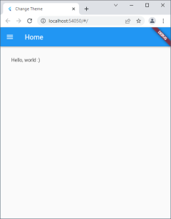
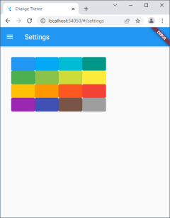
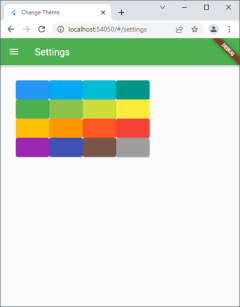
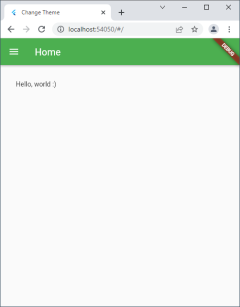

# Flutter: เปลี่ยน Theme สี

สวัสดีครับ วันนี้เราจะคุย(เขียน)เรื่อง Flutter กับการ Set ค่า Theme สี

ตอนที่ผมลองทำ มันก็เกิดคำถามว่า 

- ก่อนอื่น ผมต้องหาค่า State ของ App ซึ่งจะเปลี่ยนไปเรื่อยๆ
- Set ตัวแปร อันนี้ไม่มีปัญหาอะไร
- สั่ง setState() ใน Instance ของ Class นั้น ก็ไม่มีปัญหา ถ้าผมหา State ได้

คำตอบ findAncestorStateOfType (ขอบคุณ Google กับ Stack Overflow กับผู้รู้ที่มาตอบมากครับ ^_^) 

# ลองเขียน App Change Theme

เราจะสร้าง App ง่ายๆ ซักสองหน้า เพื่อลองทำ Theme และเปลี่ยนหน้าดู ตามรูปที่ 1

คลิกเลือกเมนูด้านซ้าย Settings จะไปหน้า Settings ดังรูปที่ 2

คลิกสีซักปุ่ม จะเปลี่ยนสีธีม ตามรูปที่ 3

พอคลิกกลับไป Home การเปลี่ยนยังมีผลอยู่ ดังรูปที่ 4

บทความนี้ใช้ Visual Studio Code + Flutter Plugin ครับ ก่อนอื่นเลือก

- Menu => View => Command Palette... จะปรากฏ Popup ตรงกลางด้านบน
- เลือก Flutter: New Project => Application จะปรากฏ Dialog
- เลือก/พิมพ์ชื่อ เพื่อสร้าง Directory สำหรับสร้างไฟล์เริ่มต้นให้

## สร้างไฟล์ drawer.dart

เป็นหน้าเมนูด้านซ้าย เรียกใช้จากหน้า Home และหน้า Settings

## สร้างไฟล์ common.dart

เป็นไฟล์เก็บ Class สำหรับให้ Class อื่นๆ เรียกใช้ได้ครับ ตอนนี้มีเรื่อง Theme เรื่องเดียว ตามด้านล่าง:

	/// Material color list.
	static List<MaterialColor> themeList = [
		Colors.blue,
		Colors.lightBlue,
		Colors.cyan,
		Colors.teal,
		Colors.green,
		Colors.lightGreen,
		Colors.lime,
		Colors.yellow,
		Colors.amber,
		Colors.orange,
		Colors.deepOrange,
		Colors.red,
		Colors.purple,
		Colors.indigo,
		Colors.brown,
		Colors.grey,
	];

	/// Current theme.
	MaterialColor get currentTheme => themeList[_indexTheme];
	int _indexTheme = 0;

	/// Change current theme.
	void changeTheme(BuildContext context, int index) {
		if (index < 0 || index >= themeList.length) return;

		if (_indexTheme != index) {
			_indexTheme = index;
			App.refresh(context);
		}
	}

App.refresh() เป็น Function ที่เราจะทำทีหลังนะครับ

## สร้างไฟล์ main.dart

ไฟล์โปรแกรมหลัก ส่วน Class App เพิ่ม Function refresh()

	class App extends StatefulWidget {
		const App({Key? key}) : super(key: key);

		@override
		_AppState createState() => _AppState();

		static void refresh(BuildContext context) =>
			context.findAncestorStateOfType<_AppState>()?.refresh();
	}

มันมี Function ให้เราใช้หา State (โดยดูด้วย Type), กรณีคือ หาค่า State ของ App, _AppState ครับ

และ _AppState

	class _AppState extends State<App> {
		@override
		Widget build(BuildContext context) {
			return MaterialApp(
				theme: ThemeData(
					primarySwatch: Common.instance().currentTheme,
				),
				routes: {
					'/': (context) => const HomePage(),
					'/settings': (context) => const SettingsPage(),
				},
				initialRoute: '/',
				title: 'Change Theme',
			);
		}

		void refresh() => setState(() {});
	}

ก็จะมี Function refresh() สร้างไว้อยู่ ส่วน setState() ก็ เซ็ตค่า + วาดใหม่ นั่นแหละครับ เหมือนกับ React (Flutter ใช้ React เป็นแนวคิด UI ครับ)

## และสุดท้าย settings.dart

เป็นหน้าแสดงปุ่มสี 16 ปุ่ม เลือกตามใจเลยครับ

# ทดลอง Run

ลองรันดู จะได้ผลลัพธ์ตามที่ต้องการ

ไม่ยากใช่มั๊ยครับ สำหรับการทำเลือกสี

สำหรับวันนี้ ลาก่อนครับ แล้วพบกันใหม่

Attachment: https://github.com/taworn-ta7/articles.flutter.change-theme

